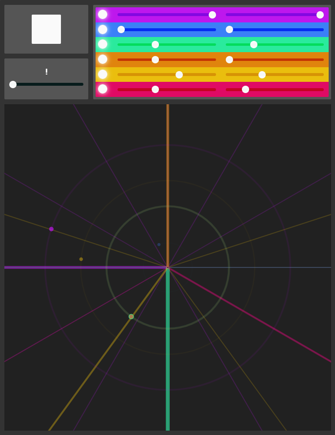

The [Drum Radar](https://drum-radar.netlify.app/) is a drum machine that visualizes rhythm as circles and spokes. Each drum track plays at constant rate in a circle, 'hitting' spokes as it passes to trigger its sample. For each drum sound you can control how big its radius is (how long the loop lasts) and how many divisions it has (how many times it will play during that loop). This allows for some interesting combinations of synced and freeform polyrhythms.
